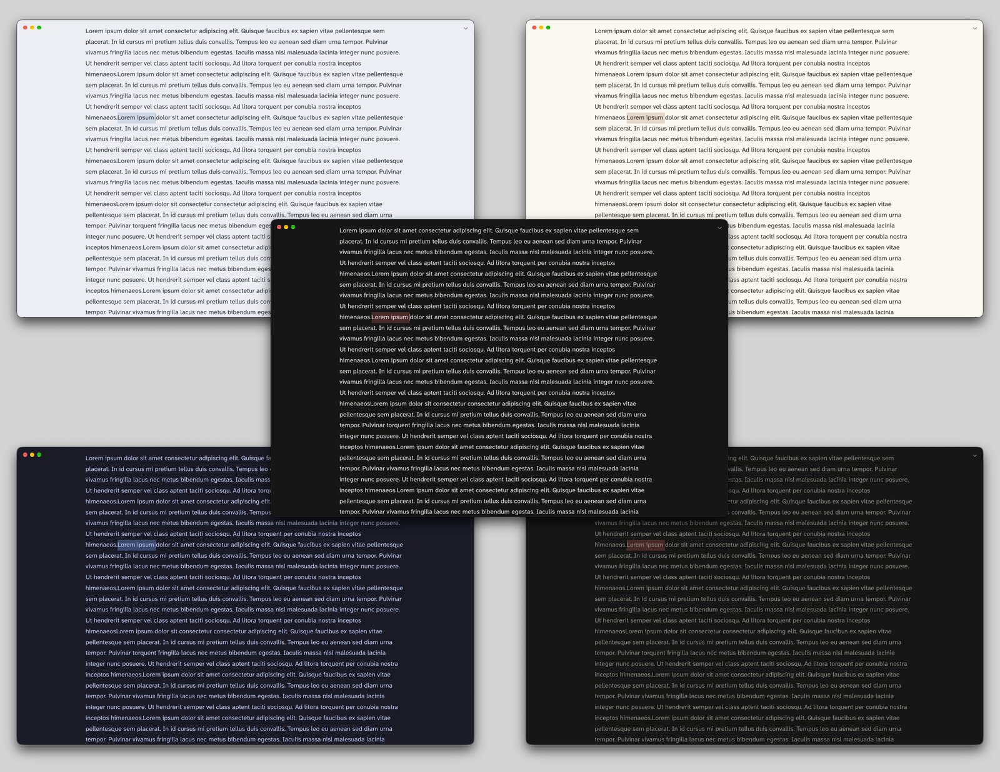
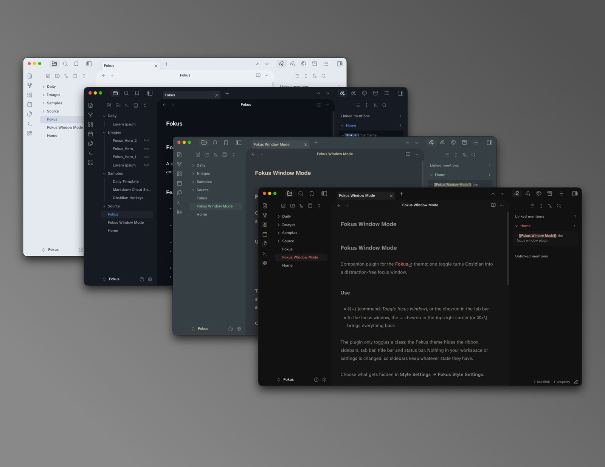
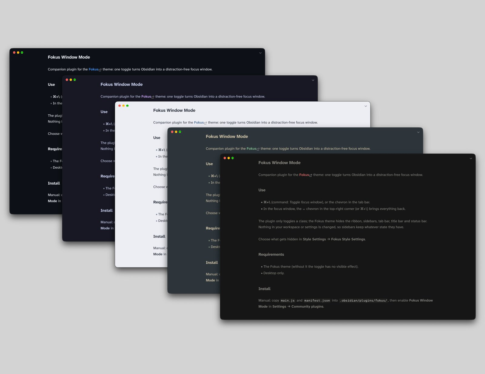

# Fokus

A borderless Obsidian theme with 20+ color schemes (light + dark each) and a distraction-free focus window.

## The interface

- **Borderless.** No divider lines: panes are set apart by tone, and menus, dialogs and the command palette float on a soft shadow.
- **20+ color schemes**, each with light and dark variants, all meeting WCAG AA contrast. *AMOLED black* makes dark backgrounds pure black.
- **Your accent.** Each scheme uses its own accent until you pick one in **Settings → Appearance → Accent color**; links, buttons, tags and highlights then follow it.
- **Rounded corners** where the editor meets the ribbon and sidebars, and in the settings window, all set by one slider (0–40 px).
- **Colored headings and colored bold / italic**, inside notes only, each with its own toggle.
- **Your fonts.** Fokus sets none; it uses whatever you choose in Appearance.
- **Line length** slider for the text column (with *Readable line length* on).

## Focus window

Needs the companion plugin **[Fokus Window Mode](https://github.com/ike-V/obsidian-fokus-window-mode)**.

**⌘+\\** or the ⌃ chevron in the tab bar turns the window into a single page of writing.

- **Hides the ribbon, tab bar, title bar and status bar** by default; keep any of them in **Style Settings → Fokus Style Settings**.
- **Sidebars stay closed** until you leave, so a stray hotkey can't pull one over your text. They return exactly as they were.
- **No scrollbars.** Scrolling still works; the bar just isn't drawn.
- **Still a normal window.** It drags by its top edge, and the macOS window buttons stay clear of your text.
- **Leave** with ⌘+\\ or the ⌄ chevron in the top-right corner. Prefer the hotkey alone? Turn on *Hide the chevron buttons*.
- **Nothing is changed** in your workspace or settings; focus mode is a single on/off switch.

## Install

**Settings → Appearance → Themes → Manage → search "Fokus" → Install and use.**

Manual: copy `theme.css` and `manifest.json` into `.obsidian/themes/Fokus/`.

## Settings

Requires the [Style Settings](https://github.com/mgmeyers/obsidian-style-settings) plugin.

| Setting | Options |
|---|---|
| Color scheme | Ayu, Catppuccin, Dracula, Everforest, Flexoki, Fokus (default), Fokus (muted), Gruvbox, Kanagawa, Night Owl, Nightfox, Nord, One, Paper, Placidity, Primer, Rosé Pine, Solarized, Tokyo Night, Violentz, Vitesse |
| AMOLED black | Pure black backgrounds (dark mode) |
| Line length | Text column width; needs Readable line length on |
| Corner radius | 0–40 px |
| Colored headings | On / off |
| Colored bold & italic | On / off |
| Hide the ribbon / tab bar / title bar / status bar | What the focus window hides |
| Hide the chevron buttons | Use ⌘+\ only |

## Credits

Unofficial ports of these open-source palettes (all MIT):

| Scheme | Palette | Author |
|---|---|---|
| Ayu | [ayu](https://github.com/ayu-theme/ayu-colors) | Konstantin Pschera |
| Catppuccin | [Catppuccin](https://github.com/catppuccin/catppuccin) | Catppuccin |
| Dracula | [Dracula](https://github.com/dracula/dracula-theme) | Zeno Rocha |
| Everforest | [Everforest](https://github.com/sainnhe/everforest) | sainnhe |
| Flexoki | [Flexoki](https://github.com/kepano/flexoki) | Steph Ango |
| Gruvbox | [gruvbox](https://github.com/morhetz/gruvbox) | Pavel Pertsev |
| Kanagawa | [kanagawa.nvim](https://github.com/rebelot/kanagawa.nvim) | Tommaso Laurenzi |
| Night Owl | [Night Owl](https://github.com/sdras/night-owl-vscode-theme) | Sarah Drasner |
| Nightfox | [nightfox.nvim](https://github.com/EdenEast/nightfox.nvim) | EdenEast |
| Nord | [Nord](https://github.com/nordtheme/nord) | Sven Greb |
| One | [One Dark / One Light](https://github.com/atom/atom) | Atom |
| Placidity | [Tailwind CSS](https://github.com/tailwindlabs/tailwindcss) indigo and gray | Tailwind Labs |
| Primer | [Primer](https://github.com/primer/primitives) | GitHub |
| Rosé Pine | [Rosé Pine](https://github.com/rose-pine/rose-pine-theme) | Rosé Pine |
| Solarized | [Solarized](https://github.com/altercation/solarized) | Ethan Schoonover |
| Tokyo Night | [Tokyo Night](https://github.com/enkia/tokyo-night-vscode-theme) | enkia |
| Vitesse | [Vitesse](https://github.com/antfu/vscode-theme-vitesse) | Anthony Fu |

Some colors were adjusted to meet contrast requirements.

## License

[MIT](LICENSE)
