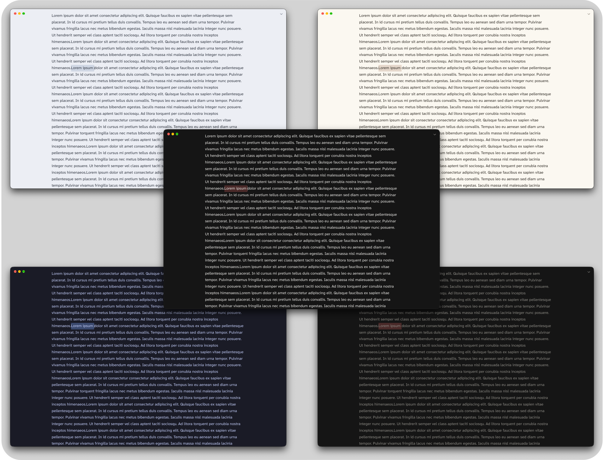
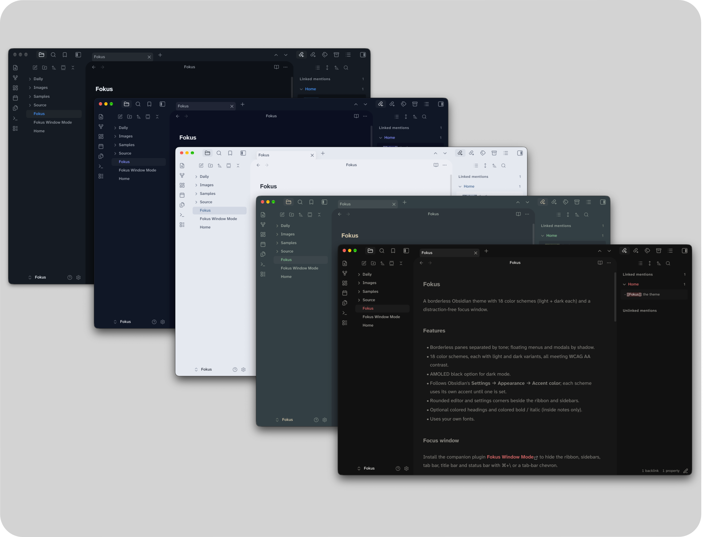
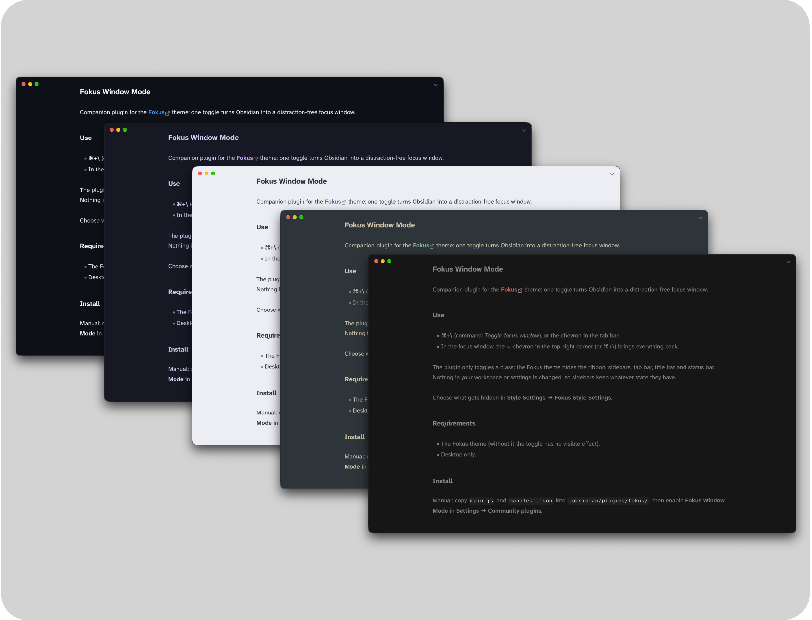
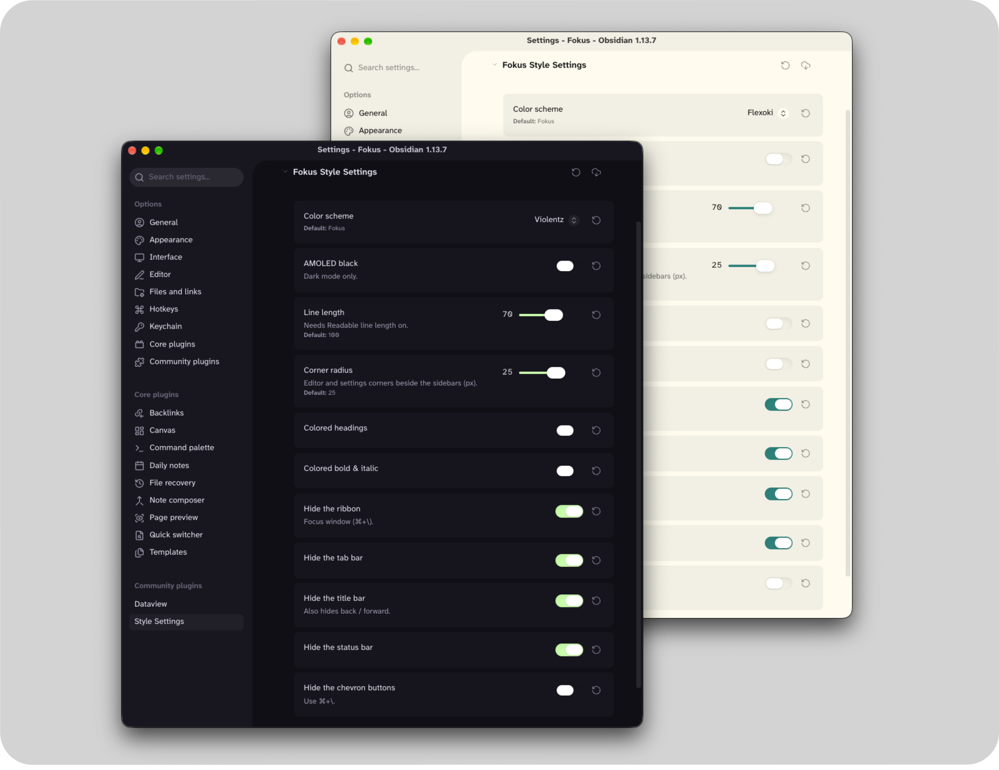

# Fokus

Fokus is a borderless Obsidian theme for people who'd rather see their notes than the app around it. It comes with more than 20 color schemes, each with a light and dark version, and the Fokus window that leaves just you and your work with as little friction as possible.

## The Themes

No divider lines anywhere. Carefully curated recreations of popular colorways, with some personally created for this release. Menus, dialogs and the command palette are all themed to match the main theme.

- **More than 20 color schemes.** Every one has a light and dark version and is checked against WCAG AA contrast, so text stays readable in all of them. An *AMOLED black* setting gives pure black backgrounds in dark mode.
- **Your accent color.** Each scheme starts with its own curated accent color. Pick a different one in **Settings → Appearance → Accent color** and links, buttons, tags and highlights all follow it.
- **Rounded corners.** One slider in [Style Settings](https://github.com/mgmeyers/obsidian-style-settings) controls the corner radius, with a comfy 25px default.
- **Colored headings and colored bold/italic.** Choose between the current theme's text color or Obsidian's built-in colored headings.
- **Adjustable line length** for the text column (with *Readable line length* turned on).

Fokus works on macOS, Windows, Linux, iOS and Android. On phones, the title bar shows just the note name, because there's no room for the folder path.

## Fokus window

With the companion plugin [Fokus Window Mode](https://github.com/ike-V/obsidian-fokus-window-mode) installed, one hotkey or the ⌃ chevron in the tab bar turns Obsidian into a single page of writing.

- **Everything else steps aside:** the ribbon, tab bar, title bar and status bar all hide. Want to keep any of them? Choose in **Style Settings → Fokus Style Settings**.
- **Sidebars stay put** until you leave, so a stray shortcut can't slide one over your text. When you come back, they're exactly how you left them.
- **No scrollbars.** You can still scroll; the bar just isn't there.
- **It's still a normal window.** You can drag it by the top edge, and on macOS the window buttons stay out of your text's way.
- **Leaving** is the same hotkey again, or the ⌄ chevron in the top-right corner. If you'd rather use only the hotkey, turn on *Hide the chevron buttons*.
- **Nothing gets rearranged.** Your workspace and settings are left alone; it's a simple on/off switch.

The hotkey isn't set by default. Turn on ⌘+\\ (Ctrl+\\ on Windows and Linux) in **Settings → Fokus Window Mode**, or pick any key you like in **Settings → Hotkeys**.

## Companion plugins

Both are optional. Without them, Fokus uses its default scheme and settings.

| Plugin | What it adds |
|---|---|
| [Fokus Window Mode](https://github.com/ike-V/obsidian-fokus-window-mode) | The Fokus window (desktop) |
| [Style Settings](https://github.com/mgmeyers/obsidian-style-settings) | The settings below: color scheme, AMOLED black, line length, corners, colors, and what the Fokus window hides |

## Install

In Obsidian, go to **Settings → Appearance → Themes → Manage**, search for "Fokus", then choose **Install and use**.

To install it manually, copy `theme.css` and `manifest.json` into `.obsidian/themes/Fokus/` inside your vault.

## Settings

These appear under **Style Settings → Fokus Style Settings**.

| Setting | What it does |
|---|---|
| Color scheme | Ayu, Catppuccin, Dracula, Everforest, Flexoki, Fokus (default), Fokus (muted), Gruvbox, Kanagawa, Night Owl, Nightfox, Nord, One, Paper, Placidity, Primer, Rosé Pine, Solarized, Tokyo Night, Violentz, Vitesse |
| AMOLED black | Pure black backgrounds in dark mode |
| Line length | How wide the text column is (needs *Readable line length* on) |
| Corner radius | 0–40 px |
| Colored headings | On or off |
| Colored bold & italic | On or off |
| Hide the ribbon / tab bar / title bar / status bar | What the Fokus window hides |
| Hide the chevron buttons | Use only the hotkey to enter and leave |

## Credits

Many of the schemes are unofficial ports of these open-source palettes, all MIT licensed. A few colors were adjusted so text meets contrast guidelines.

| Scheme | Palette | Author |
|---|---|---|
| Ayu | [ayu](https://github.com/ayu-theme/ayu-colors) | Konstantin Pschera |
| Catppuccin | [Catppuccin](https://github.com/catppuccin/catppuccin) | Catppuccin |
| Dracula | [Dracula](https://github.com/dracula/dracula-theme) | Zeno Rocha |
| Everforest | [Everforest](https://github.com/sainnhe/everforest) | sainnhe |
| Flexoki | [Flexoki](https://github.com/kepano/flexoki) | Steph Ango |
| Gruvbox | [gruvbox](https://github.com/morhetz/gruvbox) | Pavel Pertsev |
| Kanagawa | [kanagawa.nvim](https://github.com/rebelot/kanagawa.nvim) | Tommaso Laurenzi |
| Night Owl | [Night Owl](https://github.com/sdras/night-owl-vscode-theme) | Sarah Drasner |
| Nightfox | [nightfox.nvim](https://github.com/EdenEast/nightfox.nvim) | EdenEast |
| Nord | [Nord](https://github.com/nordtheme/nord) | Sven Greb |
| One | [One Dark / One Light](https://github.com/atom/atom) | Atom |
| Placidity | [Tailwind CSS](https://github.com/tailwindlabs/tailwindcss) | Tailwind Labs |
| Primer | [Primer](https://github.com/primer/primitives) | GitHub |
| Rosé Pine | [Rosé Pine](https://github.com/rose-pine/rose-pine-theme) | Rosé Pine |
| Solarized | [Solarized](https://github.com/altercation/solarized) | Ethan Schoonover |
| Tokyo Night | [Tokyo Night](https://github.com/enkia/tokyo-night-vscode-theme) | enkia |
| Vitesse | [Vitesse](https://github.com/antfu/vscode-theme-vitesse) | Anthony Fu |

## Feedback

Fokus is tested on macOS, Windows and Linux. If something looks off, please [open an issue](https://github.com/ike-V/obsidian-fokus/issues).

## License

[MIT](LICENSE)
